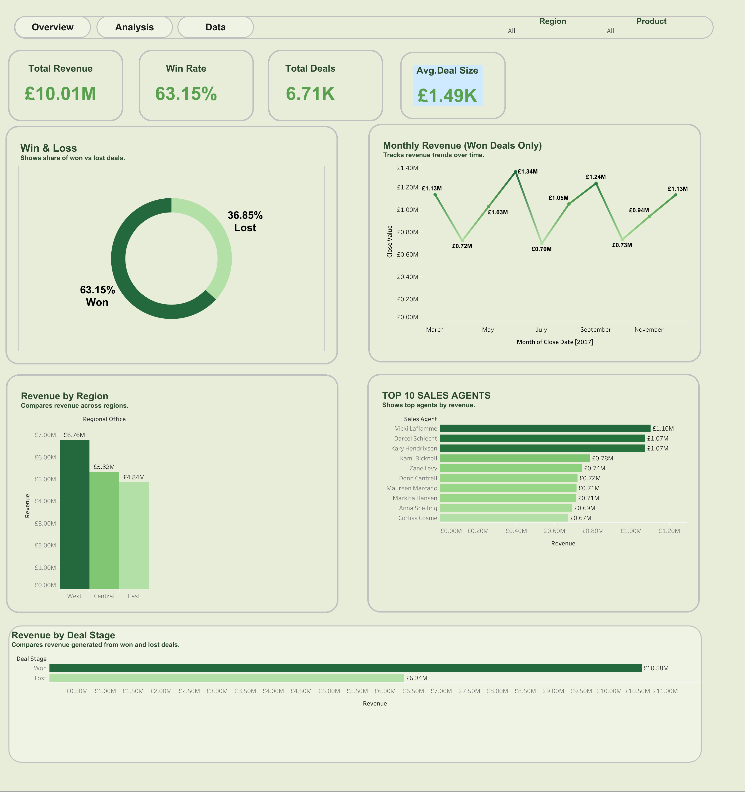
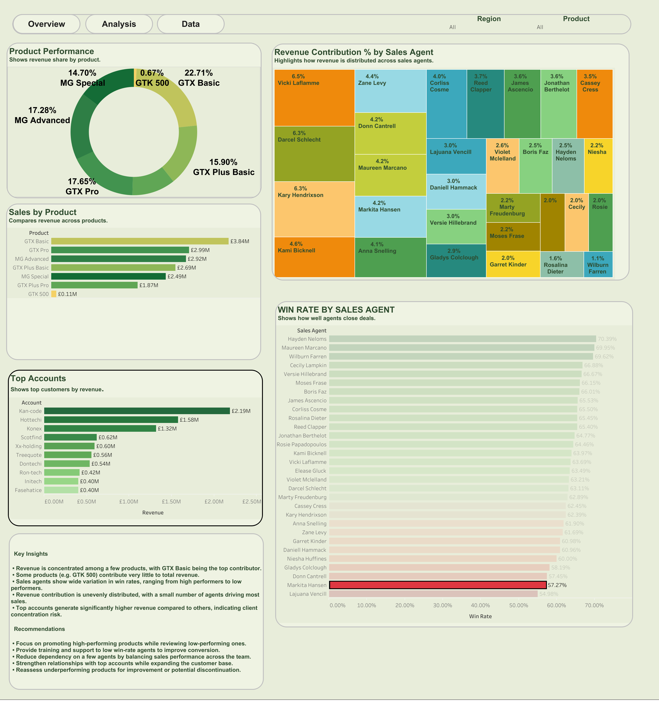
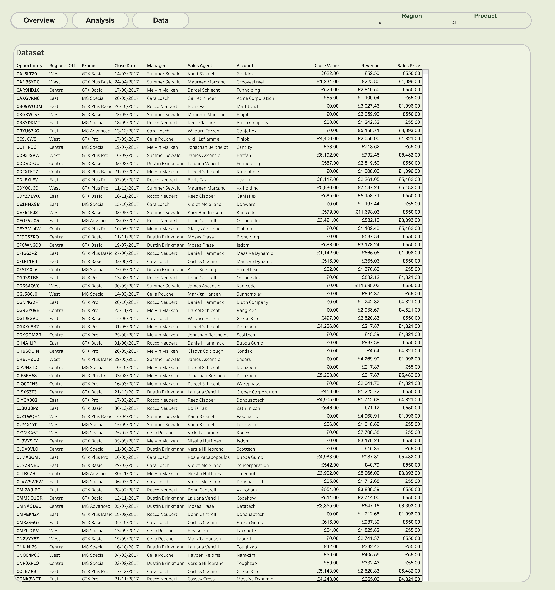

# Case Study: CRM Sales Performance Analysis

**Tools used:** Excel --- SQL --- Tableau.


This project analyzes CRM sales data to understand overall business performance across products, sales agents, regions, and customer accounts. The objective is to uncover patterns in revenue generation and generate data-driven insights that can help improve sales performance and decision-making.

The analysis focuses on identifying differences in business performance, including:

- **Revenue contribution** across different products  
- **Sales performance trends** across agents  
- **Regional performance comparison**  
- **Key behavioral insights** that can inform business strategies  
- **Opportunities to improve sales efficiency and growth**  


Table of contents

# 📑 Table of Contents

1. [Business Problem](#-business-problem)
2. [Dataset](#-dataset)
3. [Tools Used](#-tools-used)
4. [Data Preparation](#-data-preparation)
5. [SQL Analysis](#-sql-analysis)
6. [Key Insights](#-key-insights)
7. [Dashboard](#-dashboard)
8. [Business Recommendations](#-business-recommendations)
9. [Project Structure](#-project-structure)

---

# Business Problem

Businesses need better visibility into **sales performance**.

This project helps answer:

- Which products generate the most revenue?
- Which sales agents perform best?
- How does performance vary across regions?
- Which accounts contribute the most revenue?
- Where can the business improve sales outcomes?

---

# 📂 Dataset

The dataset contains CRM sales records including:

- Account  
- Close Date  
- Deal Stage  
- Manager  
- Opportunity Id  
- Product  
- Regional Office  
- Sales Agent  
- Sector  
- Series  

### Measures:

- % Change  
- Average Deal Size  
- Close Value  
- Previous Revenue  
- Revenue  
- Sales Price  
- Win Rate  

The dataset was explored and processed using **Excel** and **SQL**.

---

# Tools Used

| Tool | Purpose |
|-----|------|
| Excel | Initial exploration |
| SQL | Data analysis |
| Tableau | Data visualization |
| GitHub | Project portfolio |

---

# Data Preparation

To prepare the dataset for analysis:

- Cleaned and structured raw CRM data in Excel  
- Standardized categorical fields (Product, Region, Sales Agent)  
- Handled missing and zero values  
- Created calculated KPIs such as **Win Rate** and **Average Deal Size**

---

# SQL Analysis

### Total Revenue

```sql
SELECT SUM(close_value) AS total_revenue
FROM crm_data;
```

### Revenue by Product

```sql
SELECT product, SUM(close_value) AS revenue
FROM crm_data
GROUP BY product
ORDER BY revenue DESC;
```

### Revenue by Region

```sql
SELECT regional_office, SUM(close_value) AS revenue
FROM crm_data
GROUP BY regional_office
ORDER BY revenue DESC;
```

### Top Sales Agents

```sql
SELECT sales_agent, SUM(close_value) AS revenue
FROM crm_data
GROUP BY sales_agent
ORDER BY revenue DESC
LIMIT 10;
```

### Win Rate

```sql
SELECT 
    sales_agent,
    COUNT(CASE WHEN deal_stage = 'Won' THEN 1 END) * 1.0 / COUNT(*) AS win_rate
FROM crm_data
GROUP BY sales_agent;
```

---

# 📊 Key Insights

Based on the analysis, several important patterns were identified:

### 1. Product Performance
- GTX Basic generates the highest revenue  
- Some products contribute very little (e.g., GTX 500)

### 2. Sales Agent Performance
- A small number of agents drive most revenue  
- Performance varies significantly across agents

### 3. Regional Trends
- West region performs the strongest  
- Central and East follow behind

### 4. Revenue Distribution
- Revenue is unevenly distributed across accounts  
- Top accounts contribute a large share of total revenue

---

# 📈 Dashboard

The final analysis was visualized using **Tableau dashboards**.

The dashboard highlights:

- Product performance  
- Sales agent contribution  
- Revenue by region  
- Win rate analysis  
- Top accounts  

### Dashboard Preview

  
  


---

## Interactive Dashboard

[View the Dashboard](https://public.tableau.com/)

---

# Business Recommendations

- Focus on promoting high-performing products  
- Provide support for low-performing sales agents  
- Balance workload across regions  
- Strengthen relationships with top accounts  
- Improve underperforming products  

---

# Project Structure

- README.md – project overview  
- index.html – portfolio webpage  
- DOverview.png – dashboard overview  
- Analysis.png – analysis dashboard  
- Dataset.png – dataset view  
- ddd.png – main dashboard preview  
- profile_pic.png – profile image  

---

## Skills Demonstrated

SQL | Data Cleaning | Data Analysis | KPI Development | Tableau | Data Visualization  

---

## 👤 Author

Jeewan Gurung  
LinkedIn: https://www.linkedin.com/in/jg936  
GitHub: https://github.com/jeewan-jg  
